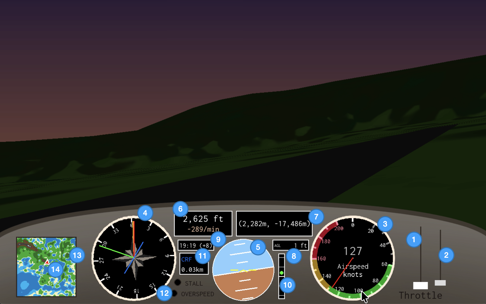

# Pylines Flight Sim

## Overview

Pylines is a lightweight, open-source flight simulator made in Python with Pygame and OpenGL. With over 39,000 km² of terrain to explore, including vast mountain ranges and rivers, it uses a simplified flight model and intuitive controls to allow users to explore the mechanics of aviation without being overwhelmed.

**Author:** Louis Masarei-Boulton  
**Version:** 0.8.5

## Features

* Dynamic sky and terrain lighting.
* Sun and moon that update in real time, in your local time zone.
* Simplified Cessna 172-inspired flight physics model and cockpit GUI.
* Runways, landing feedback, crash and damage mechanics.
* GPS and minimap for selecting destinations and navigation assistance.
* Glidescope and AGL indicator for landing assistance.

## GUI and Controls

### Cockpit GUI

1. Throttle
2. Flaps
   * Knob at the bottom = flaps down, top = flaps up.
   * Lowering the flaps increases lift and significantly increases drag, especially at large deflections.
   * Tip: flaps slightly down for takeoff, up for cruise, fully down for landing.
3. Current airspeed in knots
4. Compass
   * Red needle = heading
   * Yellow needle = direction of velocity
   * Green needle = direction to GPS destination
   * Blue line = runway heading; only shows if you are close to your GPS destination
5. Attitude Indicator
   * Each small white tick mark is 5° pitch.
   * Each large white tick mark is 10° pitch.
   * A red chevron indicates that you are climbing or descending too steeply and you should move the nose in the direction of the chevron.
6. MSL and VSI
   * MSL (Mean Sea Level) - altitude relative to sea level.
   * VSI (Vertical Speed Indicator) showing climb/descent rate in feet per minute.
7. Coordinates
   * -Z = north; +X = east
   * Coordinates are displayed relative to map centre.
8. AGL Indicator
   * AGL = Above Ground level - altitude relative to terrain directly below your plane.
   * If you are flying over the ocean, then AGL = MSL.
9.  Clock
    * Current time in hh:mm and GMT offset in hours.
10. Glidescope
    * Only activates when you are close to your GPS destination.
    * Green needle shows correct glidescope.
    * If the green needle is below the white line, you are too high and should descend.
    * If the green needle is above the white line, you are too low and should climb.
11. GPS Destination and Distance
    * GPS destination as a 3-letter code.
    * Distance to GPS destination in kilometres.
12. Warning Lights
    * Red warning lights for stall and overspeed.
13. Minimap
    * Map of the region showing your location.
    * Blue = ocean
    * Light yellow/green = low altitude
    * Dark green/brown = mid altitude
    * Grey/white = high altitude
14. You!
    * Minimap cursor displaying your current location.

Note: aviation instruments use real-world aviation units.

### Controls

**Mechanical Controls**
* W/S - increase/decrease throttle.
* Z/X - flaps up/down
* A/D - rudder
* Arrows - pitch/roll
* B - brake if grounded
* G - cycle GPS destination

**Meta Controls**
* R - reset flight
* P - return to menu

## World

* `DCM` - Darculus Metropolis
  * Runway Information:
    * Coordinates: (200, -3,000)
    * Heading: 130°/310°
  * The centre of the region. Your home base for flight training.
* `CRF` - Central Remote Fields
  * Runway Information:
    * Coordinates: (2,250, -17,500)
    * Heading: 35°/215°
  * An area of mid-altitude flatlands right next to mountains.
* `RDS` - Rebased District
  * Runway Information:
    * Coordinates: (26,250, 2,500)
    * Heading: 108°/288°
  * Low to mid altitude flatlands with a nice view of the nearby rivers.

## Project Status

**In Development**
* Core features and structure are under development and bound to change quickly.

## Planned Features

* Improved cockpit GUI layout
* PAPI lights for landing assistance
* More lore landmarks, e.g. city blocks, airports, houses
* More GPS destinations.
* Aircraft customisation
* Unit switching
* Simple flight exercises, guides, notes
* Prohibited zones and cutscenes
* Improved sound effects

## Requirements

* Python 3.x
* Pygame
* GPU with OpenGL support

> **Warning:** This project has not been tested for Windows or Linux. This project is awaiting confirmed support for these OSes.

## License

© 2025-2026 Louis Masarei-Boulton. Licensed under the Apache License, Version 2.0.