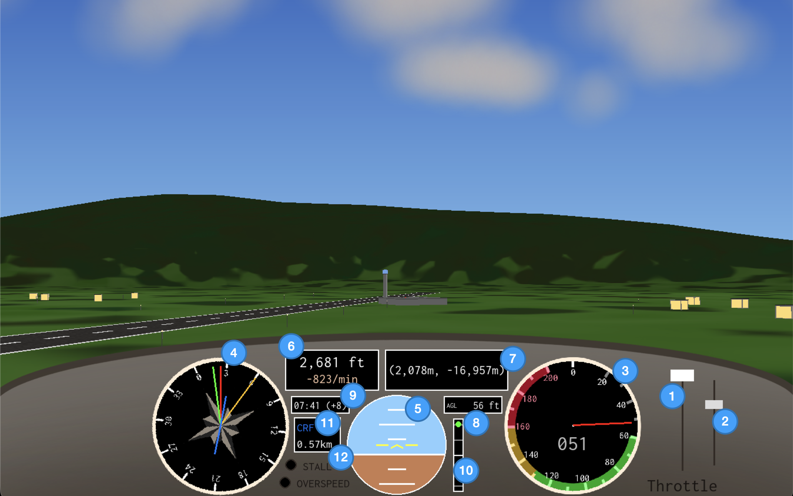
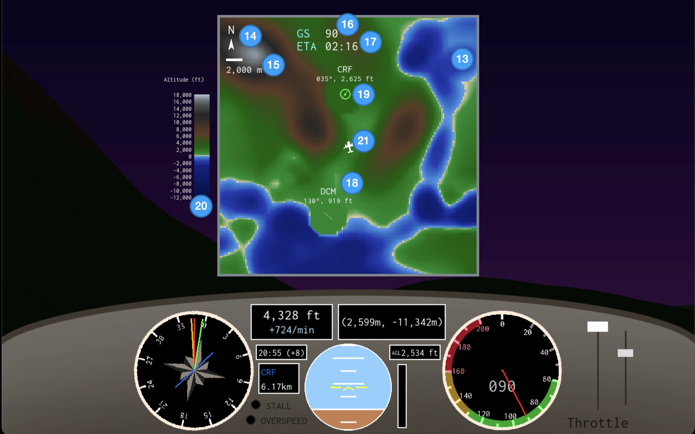

# Pylines Flight Sim

## Overview

Pylines is a lightweight, open-source flight simulator made in Python with Pygame and OpenGL. With over 39,000 km² of terrain to explore, including vast mountain ranges, rivers and small towns, it uses a simplified flight model and intuitive controls to allow users to explore the mechanics of aviation without being overwhelmed.

**Author:** Louis Masarei-Boulton  
**Version:** 0.10.3 (semantic)

## Features

* Dynamic sky, terrain and building lighting, sun and moon.
* Simplified (loosely) Cessna 172-inspired flight physics model and cockpit GUI.
* Runways, landing feedback, crash and damage mechanics.
* GPS and map viewer for selecting destinations and navigation assistance.
* Glidescope and AGL indicator for landing assistance.
* Small towns near runways to explore.

## GUI and Controls

### Cockpit GUI

1. Throttle
2. Flaps
   * Knob at the bottom = flaps down, top = flaps up.
   * Lowering the flaps increases lift and significantly increases drag, especially at large deflections.
   * Tip: flaps slightly down for takeoff, up for cruise, fully down for landing.
3. Current airspeed in knots
4. Compass
   * Red needle = heading
   * Yellow needle = direction of velocity
   * Green needle = direction to GPS destination
   * Blue line = runway heading; only shows if you are close to your GPS destination
5. Attitude Indicator / Artificial Horizon
   * Small white ticks are 5° pitch each.
   * Large white ticks are 10° each.
   * A red chevron indicates that you are climbing or descending too steeply and you should move the nose in the direction of the chevron.
6. MSL and VSI
   * MSL (Mean Sea Level) - altitude relative to sea level.
   * VSI (Vertical Speed Indicator) showing climb/descent rate in feet per minute.
7. Coordinates
   * -Z = north; +X = east
   * Coordinates are displayed relative to map centre.
8. AGL Indicator
   * AGL = Above Ground level - altitude relative to terrain directly below your plane.
   * If you are flying over the ocean, then AGL = MSL.
9.  Clock
    * Current time in hh:mm and GMT offset in hours.
10. Glidescope
    * Only activates when you are close to your GPS destination.
    * Green needle conveys correct glidescope.
    * If the green needle is below the white line, you are too high and should descend.
    * If the green needle is above the white line, you are too low and should climb.
11. GPS Destination and Distance
    * GPS destination as a 3-letter code.
    * Distance to GPS destination in kilometres.
12. Warning Lights
    * Red warning lights for stall and overspeed.

### Map View

13. View of area using colours to convey terrain height
14. North indicator
15. Scale bar
16. Ground Speed
17. ETA
    * Estimated time until arrival at the selected GPS destination
18. Runway information shown on map
19. GPS destination marker
20. Altitude-to-colour key
21. You!
    * Map icon showing your location.

Note: aviation instruments use real-world aviation units, while navigation uses metric units.

### Controls

**Mechanical Controls**
* W/S - increase/decrease throttle.
* Z/X - flaps up/down
* A/D - rudder
* Arrows - pitch/roll
* B - brake if grounded
* G - cycle GPS destination

**Map Controls** 
* M - show/hide map
* While map is open:
  * W/S - zoom in/out
  * Arrows - pan map
  * Space - re-centre

**Meta Controls**
* R - restart flight
* P - return to menu

## World

* `DCM` - Darculus Metropolis
  * Runway Information:
    * Coordinates: (200, -3,000)
    * Heading: 130°/310°
  * The central town of the region and also the most populated, full of many apartment blocks and houses. Your home base for flight training.
* `CRF` - Central Remote Fields
  * Runway Information:
    * Coordinates: (2,250, -17,500)
    * Heading: 35°/215°
  * An isolated area of mid-altitude flatlands slightly north of Darculus. The residents enjoy the view of the nearby mountains, and their personal space, as there aren't many houses in this sparse clearing.
* `RDS` - Rebased District
  * Runway Information:
    * Coordinates: (26,250, 2,500)
    * Heading: 108°/288°
  * Low to mid altitude flatlands with a cool breeze coming from the east. It also isn't too far off from some of the best beaches in the region. Darculus residents would be jealous.

## Project Status

**In Development**
* Core features and structure are mostly complete, but are likely subject to potential change.

## Planned Features

* PAPI lights for landing assistance
* More GPS destinations.
* Aircraft customisation
* Unit switching
* Simple flight exercises, guides, notes
* Prohibited zones
* Improved sound effects
* Improved low-speed turn handling

## Requirements

* Python 3.14.0+ (tested on 3.14.0)
* Pygame 2.6.1
* GPU with OpenGL support

> **Warning:** This project has not yet been tested on Windows or Linux.

## License

© 2025-2026 Louis Masarei-Boulton. Licensed under the Apache License, Version 2.0.